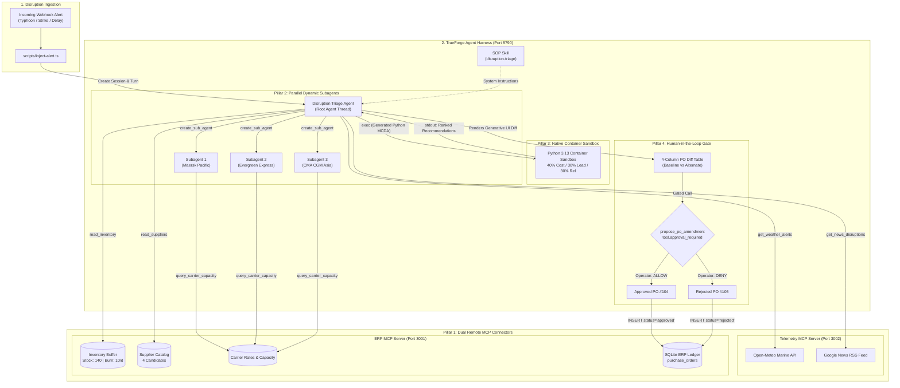

# ReRoute-LG: Autonomous Supply-Chain Disruption Triage & Safe PO Re-Routing

[](https://nodejs.org/)
[](https://www.typescriptlang.org/)
[](https://github.com/truefoundry/trueforge)
[](https://modelcontextprotocol.io/)
[-76B900.svg)](https://www.nvidia.com/en-us/ai-data-science/products/nim/)
[](https://www.sqlite.org/)
[](https://www.qodo.ai/)

> **AI Disclosure**: AI coding assistants (Claude / Gemini) were used during development for boilerplate scaffolding, test harness generation, and documentation drafting. All architectural decisions, system prompts, safety guardrails, code review remediations, and final implementations were directed, reviewed, and verified by the author.

**ReRoute-LG** is an autonomous supply-chain triage agent built on the **TrueForge Agent Harness**. When maritime corridors are compromised by severe weather or labor unrest, ReRoute-LG corroborates signals via live external MCP telemetry, analyzes inventory burn rates to project stockout dates, spawns parallel dynamic subagents to query ocean freight capacity, generates and executes a Python optimization model inside TrueForge's persistent container sandbox, and renders a **Generative UI PO Diff** before pausing at a human-in-the-loop approval gate.

---

## Table of Contents
1. [Executive Summary & Problem Statement](#executive-summary--problem-statement)
2. [TrueForge Core Capabilities (The Four Pillars)](#trueforge-core-capabilities-the-four-pillars)
3. [System Architecture & Data Flow](#system-architecture--data-flow)
4. [The Disruption Triage Protocol](#the-disruption-triage-protocol)
5. [Quickstart: Running the Demo](#quickstart-running-the-demo)
6. [Demo Scenarios & Test Fixtures](#demo-scenarios--test-fixtures)
7. [Production Migration Strategy](#production-migration-strategy)
8. [Software Requirements Specification (SRS) & Traceability](#software-requirements-specification-srs--traceability)
9. [Qodo Code Review Evidence](#qodo-code-review-evidence)
10. [Automated Verification Matrix](#automated-verification-matrix)

---

## Executive Summary & Problem Statement

### The Problem
When severe weather (e.g. Category 4 super typhoons) or geopolitical disruptions shut down key maritime corridors (e.g. East China Sea, Port of Ningbo-Zhoushan), manufacturing supply chains face immediate stockout risks. Traditional enterprise resource planning (ERP) workflows require days of manual email coordination, spreadsheet cross-referencing, and phone calls to find alternate suppliers, verify inventory burn rates, and amend purchase orders. By the time human operators finish triage, assembly lines are already idle.

Conversely, unconstrained autonomous LLM agents introduce acute financial hazards: ungrounded supplier quotes, unchecked budget overruns, and phantom inventory writes without human oversight.

### The Solution: ReRoute-LG
ReRoute-LG strikes the balance: **autonomous investigation paired with deterministic execution guardrails and mandatory human authorization**:
- **Autonomous Ingestion & Telemetry**: Ingests disruption alerts and verifies ground-truth conditions using live meteorological APIs (Open-Meteo) and live news feeds (Google News RSS).
- **ERP Integration via MCP**: Connects to the enterprise database using standardized Model Context Protocol (MCP) tools for inventory buffers, supplier catalogs, and ocean carrier capacities.
- **Strict Guardrail Filtering**: Discards candidates exceeding a **+50% cost ceiling**, falling below **0.75 reliability**, or failing the **Days of Supply (DoS)** constraint (`lead_time_days < DoS`).
- **Sandboxed Python Optimization**: Dynamically generates and executes a Python scoring script inside TrueForge's container sandbox (40% Cost, 30% Lead Time, 30% Reliability).
- **Generative UI PO Diff**: Renders a 4-column Markdown diff table directly in chat comparing baseline supplier metrics against the proposed alternate.
- **Human Approval Gate**: TrueForge enforces a strict pause before executing `propose_po_amendment`. Only human authorization (`allow`) commits the PO to the database; denial (`deny`) triggers an audit log (`record_po_rejection`).

---

## TrueForge Core Capabilities (The Four Pillars)

ReRoute-LG directly exercises every core capability of the TrueForge agent harness:

- **1. Remote Model Context Protocol (MCP) Connectors**: Decouples enterprise systems into two remote MCP microservices communicating over Server-Sent Events (SSE): `erp-mcp` (Port 3001, enterprise database) and `telemetry-mcp` (Port 3002, live weather & news feeds).
- **2. Parallel Dynamic Subagents**: Spawns isolated child agent threads using TrueForge's native `create_sub_agent` tool to evaluate transit times, rates per TEU, and space allocations across multiple ocean carriers in parallel (`maersk-pacific`, `evergreen-express`, `cma-cgm-asia`).
- **3. Native Container Sandbox (`exec`)**: Instead of relying on static server-side ranking, the agent writes a Python Multi-Criteria Decision Analysis (MCDA) script on the fly and executes it inside TrueForge's persistent container sandbox via the built-in `exec` tool to compute weighted composite trade-offs (40% Cost, 30% Lead Time, 30% Reliability).
- **4. Human-in-the-Loop Approval Gate**: Enforces zero unauthorized database mutations via TrueForge's native `tool.approval_required` policy on `propose_po_amendment`. The agent renders a 4-column Generative UI PO Diff table in chat and halts execution until an operator clicks **Allow** or **Deny**.

---

## System Architecture & Data Flow



---

## The Disruption Triage Protocol

When an alert arrives, the agent autonomously executes the standard operating procedure (SOP):

1. **Step 0: Live Telemetry Corroboration**: Queries `get_weather_alerts` or `get_news_disruptions`. If live telemetry diverges from the synthetic alert (e.g. calm winds during a simulated storm), the agent notes the divergence and proceeds on the authoritative alert severity.
2. **Step 1: Inventory Buffer Analysis**: Calls `read_inventory` to calculate **Days of Supply (DoS)**: $\text{DoS} = \frac{\text{Current Stock}}{\text{Daily Burn Rate}} = \frac{140}{10} = 14\text{ days}$.
3. **Step 2: Alternate Supplier Discovery**: Calls `read_suppliers` to identify vendors outside the disrupted corridor.
4. **Step 3: Parallel Carrier Queries**: Spawns parallel dynamic subagents via `create_sub_agent` to query `query_carrier_capacity` across ocean carriers.
5. **Step 4: Guardrail Filtering**: Discards candidates exceeding $+50\%$ cost ceiling, falling below $0.75$ reliability, or with $\text{lead time} \ge \text{DoS}$ (Baltic Precision disqualified: $28\text{d} \ge 14\text{d}$).
6. **Step 5: Sandboxed Multi-Criteria Optimization**: Generates and executes a Python scoring script via TrueForge's container sandbox `exec` tool (40% Cost, 30% Lead, 30% Reliability), confirming IndoPacific Parts Corp as Rank 1.
7. **Step 6: Generative UI PO Diff**: Emits a 4-column Markdown table directly in chat comparing baseline vs. proposed alternate.
8. **Step 7: Human Approval Gate**: Invokes `propose_po_amendment`. TrueForge pauses execution awaiting operator authorization (`allow` or `deny`).

### Generative UI PO Diff

| Metric | Baseline (Oceanic Bearings Ltd) | Proposed Alternate (IndoPacific Parts Corp) | Variance / Delta |
|:---|:---|:---|:---|
| **Supplier Name** | Oceanic Bearings Ltd (ID: 1) | IndoPacific Parts Corp (ID: 4) | Re-routed alternate |
| **Origin Corridor** | East China Sea *(Disrupted)* | Southeast Asia *(Safe corridor)* | Typhoon bypassed |
| **Unit Cost** | $42.50 | $47.50 | +$5.00 (+11.8%) |
| **Lead Time** | 14 days | 12 days | -2 days (-14.3%) |
| **Reliability Score** | 0.94 | 0.89 | -0.05 (-5.3%) |
| **Order Quantity** | 200 units | 200 units | 0 units |
| **Total PO Value** | $8,500.00 | $9,500.00 | +$1,000.00 (+11.8%) |
| **Guardrails** | Baseline PO | Compliant *(<= +50% cost, >= 0.75 rel, < DoS)* | Verified |

---

## Quickstart: Running the Demo

### 1. Prerequisites
- **Node.js**: `v22.13.0` or higher (`node -v`)
- **npm**: `v10` or higher
- **TrueForge Instance**: Running locally at `http://localhost:8790` with a configured model (e.g. NVIDIA Nemotron 3 Super 120B via NIM).

### 2. Installation & Setup
```bash
git clone https://github.com/ansuman-satapathy/reroute-lg.git
cd reroute-lg
npm install
cp .env.example .env
```

### 3. Initialize Database & Clean Session History
```bash
npm run db:reset
npm run sessions:clear
```

### 4. Start MCP Servers
```bash
npm run start:mcp
```
*(Leave running in a dedicated terminal window).*

### 5. Wire Agent in TrueForge
```bash
npm run config:agent
```

### 6. Inject Alert & Run Triage Demo
```bash
npm run inject-alert
```

### 7. Interactive Human Approval
1. Open `http://localhost:8790` in your browser.
2. Select the active session.
3. Observe live telemetry, inventory buffer calculation, expanded `exec` sandbox code execution, and the Generative UI PO Diff table.
4. Click **Allow** on the approval gate to commit Purchase Order #104.

---

## Demo Scenarios & Test Fixtures

| Scenario | Command | Fixture Path | Expected Agent Behavior |
|:---|:---|:---|:---|
| **Category 4 Typhoon** *(Primary Demo)* | `npm run inject-alert` | `fixtures/disruption-alert.json` | Corroborates Open-Meteo telemetry, computes 14d DoS, runs Python MCDA in sandbox, renders PO Diff, triggers gate. |
| **Port Labor Strike** *(News Routing)* | `npm run inject-alert:strike` | `fixtures/strike-alert.json` | Corroborates Google News RSS, identifies Ningbo port dispute, re-routes away from compromised corridor. |
| **Routine Dredging** *(Negative Path)* | `npm run inject-alert:low` | `fixtures/low-severity-alert.json` | Detects LOW severity and 0-hour delay; logs note without triggering unnecessary re-routing or PO amendments. |
| **Unrelated Region Alert** *(Filter Path)* | `npm run inject-alert -- --fixture fixtures/unrelated-region-alert.json` | `fixtures/unrelated-region-alert.json` | Evaluates seismic alert in South America, confirms zero ERP supplier exposure, and cleanly terminates. |
| **Timing Benchmark** *(Demo Readiness)* | `npm run demo:time` | `fixtures/disruption-alert.json` | Measures wall-clock execution latency (**typically 45–60s across runs**, well within the 3-minute video limit). |

---

## Production Migration Strategy

| Component | Hackathon Demonstration | Production Deployment |
|:---|:---|:---|
| **Disruption Trigger** | **Synthetic Webhook (`inject-alert.ts`)**<br/>Simulated event injection using versioned JSON fixtures (`fixtures/disruption-alert.json`). | **Live Webhook Gateway**<br/>FastAPI / Express webhook endpoint subscribing to NOAA, GDACS, or project44 maritime feeds. |
| **Corroboration Telemetry** | **Live MCP API Calls**<br/>Real-time queries to Open-Meteo Marine API and Google News RSS feeds. | **Identical Live MCP Calls**<br/>Enterprise weather/news APIs (DTN, Lloyd’s List) plugged into the same MCP interface. |
| **ERP Ledger** | **SQLite Ledger (`data/erp.db`)**<br/>Lightweight, deterministic ACID database with foreign keys & check constraints. | **SAP S/4HANA or Oracle Cloud ERP**<br/>Swap SQLite queries in `db.ts` with SAP BAPI, OData, or NetSuite REST APIs. |
| **Human Authorization** | **TrueForge UI Interactive Modal**<br/>Operator reviews Generative UI PO Diff and authorizes via **Allow / Deny** buttons. | **TrueForge Slack / Teams Integration**<br/>Interactive approval card dispatched to enterprise `#supply-chain-ops` channel. |

---

## Software Requirements Specification (SRS) & Traceability

Every pull request, commit, and test in ReRoute-LG links to a formal Functional Requirement (`FR-1` through `FR-23`) and Non-Functional Requirement (`NFR-1` through `NFR-5`). The complete specification is maintained in:

👉 **[Complete Software Requirements Specification (docs/SRS.md)](docs/SRS.md)**

### Requirements Traceability Summary
| Domain | Requirement IDs | Core Capabilities & Gating | Primary PRs |
|:---|:---:|:---|:---:|
| **Agent Harness** | `FR-1` – `FR-5` | TrueForge session setup, Nemotron-3 steering, MCP hubs, SOP skill injection | PR #1, #5, #11 |
| **External Telemetry** | `FR-6` – `FR-8` | Live marine weather (Open-Meteo), news RSS, normalized signal schemas | PR #4 |
| **ERP Data Access** | `FR-9` – `FR-11a` | Inventory buffer & Days of Supply (DoS), supplier quotes, strict SQL write allowlist | PR #2, #3, #6 |
| **Operational Guardrails**| `FR-12` – `FR-15` | High-severity routing, <= +50% cost band, >= 0.75 reliability, lead time < DoS | PR #7, #11 |
| **Subagent Delegation** | `FR-16` – `FR-17` | Parallel carrier evaluations via `create_sub_agent`, trace linkage | PR #8 |
| **Sandboxed Optimization** | `FR-18` – `FR-19` | Generated Python MCDA running in TrueForge container sandbox via `exec` | PR #9, #14 |
| **Approval Gate & Diff** | `FR-20` – `FR-23` | Generative UI PO Diff, TrueForge `tool.approval_required` gate, Allow/Deny paths | PR #10, #11, #13 |
| **Non-Functional** | `NFR-1` – `NFR-5` | Zero secrets, sub-90s latency (45–60s), 24h PO idempotency, audit trail replay | PR #1, #10, #11, #12 |

---

## Qodo Code Review Evidence

Across the development lifecycle, every pull request was audited by **Qodo** across repository coding standards and functional specification adherence.

### Key Remediations Addressed via Qodo Review

| Area | Severity | Resolution Summary | Pull Request |
|:---|:---:|:---|:---:|
| **Sandbox Execution** | High | Mandated TrueForge native `exec` sandbox tool for Python MCDA scoring; eliminated stale fallback references. | **[PR #14](https://github.com/ansuman-satapathy/reroute-lg/pull/14)** |
| **Database Reset Inodes** | High | Preserved SQLite file inodes in `db:reset` using in-place table drops, preventing stale file descriptor errors in active daemons. | **[PR #13](https://github.com/ansuman-satapathy/reroute-lg/pull/13)** |
| **Stockout Boundary & Idempotency**| High | Enforced strict `lead_time_days >= daysOfSupply` boundary condition and added automated 24h idempotency test suite. | **[PR #12](https://github.com/ansuman-satapathy/reroute-lg/pull/12)** |
| **SQL Security Policy** | High | Enforced strict write allowlist in `getErpWriteDb()` restricting schema mutations exclusively to `purchase_orders`. | **[PR #3](https://github.com/ansuman-satapathy/reroute-lg/pull/3)** |
| **Canonical SKU Identity** | High | Added canonical `sku` column and `idx_po_sku` index to `purchase_orders`, eliminating fuzzy note matching for exact idempotency. | **[PR #2](https://github.com/ansuman-satapathy/reroute-lg/pull/2)** |
| **Subagent Thread Isolation** | Medium | Verified child tool calls isolate strictly inside subagent threads without polluting parent context. | **[PR #8](https://github.com/ansuman-satapathy/reroute-lg/pull/8)** |
| **Gate Test Rigor** | Medium | Enforced `status === 'done'` strictly on both approval and denial paths, disallowing masking of post-execution turn errors. | **[PR #10](https://github.com/ansuman-satapathy/reroute-lg/pull/10)** |

---

## Automated Verification Matrix

Run the full suite of automated tests to verify system integrity:

```bash
# 1. Verify TypeScript types and ERP MCP security policies
npm run typecheck
npm run test:erp

# 2. Verify database schema, foreign keys, and CHECK constraints
npm run db:verify

# 3. Verify parallel carrier subagents execution (create_sub_agent)
npm run test:subagents

# 4. Verify live alert ingestion & multi-tool triage
npm run test:inject-alert

# 5. Verify TrueForge approval gate (both Approve & Reject paths)
npm run test:approval

# 6. Verify 24h PO idempotency guard & strict stockout boundary
npm run test:idempotency

# 7. Verify end-to-end timing benchmark to approval gate
npm run demo:time
```

---

## Submission Details & Track
- **Project**: ReRoute-LG
- **Track**: Agentic AI / Best Use of TrueForge & Model Context Protocol (MCP)
- **Author**: Ansuman Satapathy
