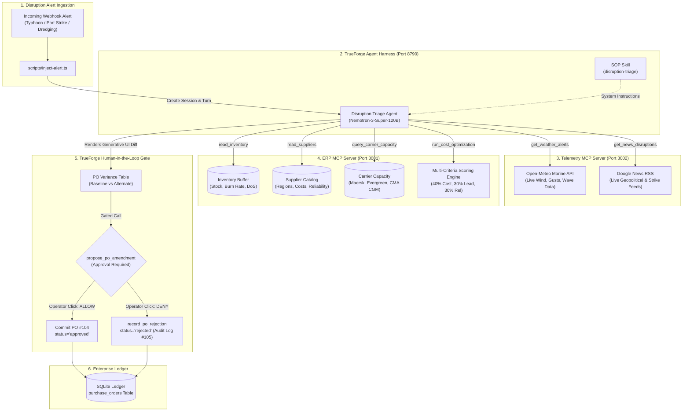
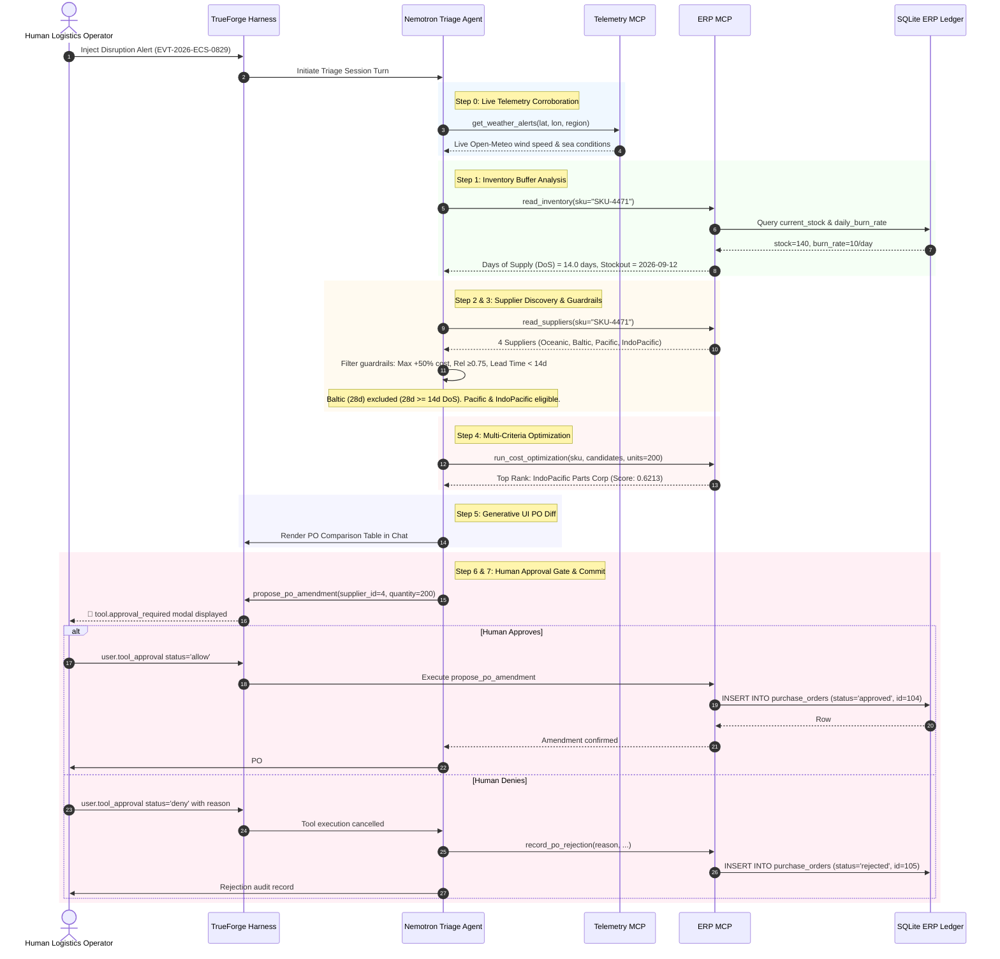

# ReRoute-LG: Autonomous Supply-Chain Disruption Triage & Safe PO Re-Routing

[](https://nodejs.org/)
[](https://www.typescriptlang.org/)
[](https://github.com/truefoundry/trueforge)
[](https://modelcontextprotocol.io/)
[](https://www.nvidia.com/en-us/ai-data-science/products/nim/)
[--blue.svg)](https://www.sqlite.org/)
[](https://www.qodo.ai/)

**ReRoute-LG** is a production-grade autonomous agent system that detects critical supply-chain disruptions in real time, corroborates external weather and news signals via live Model Context Protocol (MCP) servers, calculates buffer vulnerabilities across enterprise inventory, executes deterministic multi-criteria cost/lead-time optimization, and presents a **Generative UI PO Diff** inside the **TrueForge Agent Harness** before pausing at a human-in-the-loop approval gate.

---

## 📑 Table of Contents
1. [Executive Summary & Problem Statement](#-executive-summary--problem-statement)
2. [System Architecture & Data Flow](#-system-architecture--data-flow)
3. [The Seven-Step Disruption Triage Lifecycle](#-the-seven-step-disruption-triage-lifecycle)
4. [TrueForge Role & Human Approval Gate](#-trueforge-role--human-approval-gate)
5. [Quickstart: Zero to Demo in 5 Minutes](#-quickstart-zero-to-demo-in-5-minutes)
6. [Demo Scenarios & Test Fixtures](#-demo-scenarios--test-fixtures)
7. [Production Migration Strategy](#-production-migration-strategy)
8. [Qodo Code Review Evidence](#-qodo-code-review-evidence)
9. [Automated Verification Matrix](#-automated-verification-matrix)

---

## 🎯 Executive Summary & Problem Statement

### The Problem
When severe weather (e.g. Category 4 super typhoons) or geopolitical disruptions shut down key maritime corridors (e.g. East China Sea, Port of Ningbo-Zhoushan), manufacturing supply chains face immediate stockout risks. Traditional enterprise resource planning (ERP) workflows require days of manual email coordination, spreadsheet cross-referencing, and phone calls to find alternate suppliers, verify inventory burn rates, and amend purchase orders. By the time human operators finish triage, assembly lines are already idle.

Conversely, naive autonomous LLM agents present catastrophic financial risks: hallucinated supplier quotes, unchecked budget overruns, and phantom inventory writes without human oversight.

### The Solution: ReRoute-LG
ReRoute-LG strikes the balance: **autonomous investigation paired with deterministic execution guardrails and mandatory human authorization**:
- **Autonomous Ingestion & Telemetry**: Automatically ingests incoming disruption alerts and verifies ground-truth conditions using live meteorological APIs (Open-Meteo) and live news feeds (Google News RSS).
- **ERP Integration via MCP**: Connects to the enterprise ledger using standardized Model Context Protocol (MCP) tools for inventory buffers, supplier catalogs, and ocean carrier capacities.
- **Strict Guardrail Filtering**: Discards candidates exceeding a **+50% cost ceiling**, falling below **0.75 reliability**, or failing the **Days of Supply (DoS)** constraint (`lead_time_days < DoS`).
- **Deterministic Multi-Criteria Optimization**: Ranks compliant alternatives using a weighted scoring function ($40\%$ Cost, $30\%$ Lead Time, $30\%$ Reliability).
- **Generative UI PO Diff**: Renders a rich Markdown diff table directly in chat comparing baseline supplier metrics against the proposed alternate.
- **Human Approval Gate**: TrueForge enforces a strict pause before executing `propose_po_amendment`. Only human authorization (`allow`) commits the PO to the database; denial (`deny`) triggers an immutable audit log (`record_po_rejection`).

---

## 🏗️ System Architecture & Data Flow



---

## 🔄 The Seven-Step Disruption Triage Lifecycle



---

## 🛡️ TrueForge Role & Human Approval Gate

### Why TrueForge?
TrueForge is **not** a generic LLM chat wrapper. It serves as the enterprise runtime harness providing:
1. **Tool Approval Gating**: Configures explicit permission policies on dangerous operations. In our agent manifest, `propose_po_amendment` is flagged with `approval: required`, while read-only inspection tools (`read_inventory`, `read_suppliers`, `get_weather_alerts`) execute autonomously without interruption.
2. **Standardized MCP Connector Hub**: Manages bidirectional Server-Sent Events (SSE) connections to both `erp-mcp` (`http://localhost:3001/sse`) and `telemetry-mcp` (`http://localhost:3002/sse`).
3. **Deterministic Model Steering**: Configures model execution parameters (`temperature: 0.6`, `topP: 0.95`) for NVIDIA Nemotron 3 Super, ensuring zero schema hallucinations and consistent JSON arguments.
4. **Typed Audit Trails**: Preserves an immutable, chronological event log of every turn (`turn.created`, `tool_calls`, `tool.approval_required`, `user.tool_approval`, `tool.response`), making triage runs fully reconstructable for corporate governance.

### The Generative UI PO Diff
Before triggering the approval gate, the agent autonomously formats and renders a **Generative UI PO Diff** comparing the disrupted baseline order against the proposed alternate:

| Metric | Baseline (Oceanic Bearings Ltd) | Proposed Alternate (IndoPacific Parts Corp) | Variance / Delta |
|:---|:---|:---|:---|
| **Supplier Name** | Oceanic Bearings Ltd (ID: 1) | IndoPacific Parts Corp (ID: 4) | Re-routed alternate |
| **Origin Corridor** | East China Sea *(Disrupted)* | Southeast Asia *(Safe corridor)* | Typhoon bypassed |
| **Unit Cost** | $42.50 | $47.50 | +$5.00 (+11.8%) |
| **Lead Time** | 14 days | 12 days | -2 days (-14.3%) |
| **Reliability Score** | 0.94 | 0.89 | -0.05 (-5.3%) |
| **Order Quantity** | 200 units | 200 units | 0 units |
| **Total PO Value** | $8,500.00 | $9,500.00 | +$1,000.00 (+11.8%) |
| **Guardrails** | Baseline PO | Compliant *(≤+50% cost, ≥0.75 rel, < DoS)* | ✅ Verified |

---

## 🚀 Quickstart: Zero to Demo in 5 Minutes

### 1. Prerequisites
- **Node.js**: `v22.13.0` or higher (`node -v`)
- **npm**: `v10` or higher
- **TrueForge Instance**: Running locally at `http://localhost:8790` with NVIDIA NIM configured (`nvidia-nim/nemotron-3-super-120b-a12b`).

### 2. Installation & Environment
Clone the repository and install dependencies:
```bash
git clone https://github.com/ansuman-satapathy/reroute-lg.git
cd reroute-lg
npm install
```

Copy the environment template:
```bash
cp .env.example .env
```
*(Default `.env` values are pre-configured for local execution against `http://localhost:8790`)*.

### 3. Initialize ERP Database
Atomically initialize and seed the SQLite ERP ledger with pristine baseline records (16 suppliers, 13 inventory items, 3 baseline historical POs):
```bash
npm run db:reset
npm run db:verify
```

### 4. Start MCP Servers
Launch both the ERP MCP server (port 3001) and Telemetry MCP server (port 3002):
```bash
npm run start:mcp
```
*Leave this terminal running, or run it in the background.*

### 5. Wire Agent in TrueForge
Register the MCP connectors, upload the Disruption Triage SOP skill, and configure `disruption-triage-agent`:
```bash
npm run config:agent
```

### 6. Inject Alert & Run Triage Demo
Inject the primary Category 4 Super Typhoon alert:
```bash
npm run inject-alert
```

### 7. Interactive Human Approval
1. Open your browser to `http://localhost:8790`.
2. Open the active session created by `disruption-triage-agent`.
3. Observe the live telemetry check, buffer calculation, alternate supplier scoring, and Generative UI PO Diff.
4. Expand the final step to view the **Human Approval Gate**.
5. Click **Allow** to commit the purchase order amendment (`status='approved'`), or **Deny** to record an audit rejection log.

---

## 🧪 Demo Scenarios & Test Fixtures

| Scenario | Command | Fixture Path | Expected Agent Behavior |
|:---|:---|:---|:---|
| **Category 4 Typhoon** *(Primary Demo)* | `npm run inject-alert` | `fixtures/disruption-alert.json` | Corroborates via Open-Meteo, calculates 14-day DoS, optimizes alternate, renders PO Diff, triggers gate. |
| **Port Labor Strike** *(News Routing)* | `npm run inject-alert:strike` | `fixtures/strike-alert.json` | Routes to `get_news_disruptions` (Google News RSS), identifies labor halt, proceeds to alternate PO re-route. |
| **Routine Dredging Advisory** *(Negative Path)* | `npm run inject-alert:low` | `fixtures/low-severity-alert.json` | Detects LOW severity and 0-hour delay; logs informational note with zero unnecessary re-routing or PO amendments. |
| **Unrelated Region Alert** *(Filter Path)* | `npm run inject-alert -- --fixture fixtures/unrelated-region-alert.json` | `fixtures/unrelated-region-alert.json` | Analyzes seismic event in South America, detects no supplier exposure, and halts without triage. |
| **Timing Benchmark** *(Demo Readiness)* | `npm run demo:time` | `fixtures/disruption-alert.json` | Runs end-to-end benchmark measuring exact wall-clock latency to gate (**60.31 seconds**). |

---

## 🏭 Production Migration Strategy

### Synthetic Ingestion vs. Live External Tools
A critical distinction in ReRoute-LG is our hybrid design for hackathon evaluation versus production deployment:

| Layer | Hackathon Implementation | Production Implementation |
|:---|:---|:---|
| **Disruption Trigger** | **Synthetic Webhook (`inject-alert.ts`)**<br/>Simulated event injection using versioned JSON fixtures (`fixtures/disruption-alert.json`). | **Live Webhook Gateway**<br/>FastAPI / Express webhook endpoint subscribing to NOAA, GDACS, or maritime risk feeds (e.g. Everstream, project44). |
| **Corroboration Tools** | **Live MCP API Calls**<br/>Real queries to Open-Meteo Marine API and Google News RSS feeds. | **Identical Live MCP Calls**<br/>Enterprise weather/news APIs (DTN, Lloyd’s List) plugged directly into MCP server. |
| **ERP Ledger** | **SQLite with Foreign Keys & Constraints**<br/>Lightweight, deterministic local database. | **SAP S/4HANA or Oracle Cloud ERP**<br/>Swap SQLite queries in `mcp-servers/erp/src/db.ts` with SAP BAPI or OData connector. |
| **Human Authorization** | **TrueForge UI Modal**<br/>Web interface Allow/Deny buttons. | **TrueForge Slack / Teams Integration**<br/>Approval request interactive card dispatched to `#logistics-ops` Slack channel. |

### Why This Design De-Risks Demonstration
Option A de-risks demo recording: **incoming alert severity is authoritative for triggering triage**, while live telemetry is used for corroboration and enrichment. If live weather in the East China Sea is calm on recording day, the agent notes the divergence but continues its protocol. This prevents live network latency or calm weather from breaking a video recording while keeping external tools genuinely live.

---

## 🔍 Qodo Code Review Evidence

Across the development lifecycle, every pull request was audited by **Qodo** across two axes: repository coding standards and functional specification adherence.

### Key Remediations Addressed via Qodo Review
```
┌─────────────────────────┬──────────┬────────────────────────────────────────────────────────────────────────┐
│ Area                    │ Severity │ Resolution Summary                                                     │
├─────────────────────────┼──────────┼────────────────────────────────────────────────────────────────────────┤
│ SQL Security Policy     │ High     │ Enforced strict write allowlist in getErpWriteDb() restricting schema  │
│                         │          │ mutations exclusively to the purchase_orders table.                    │
├─────────────────────────┼──────────┼────────────────────────────────────────────────────────────────────────┤
│ Canonical SKU Identity  │ High     │ Added canonical sku column and idx_po_sku index to purchase_orders,   │
│                         │          │ eliminating fuzzy note matching and ensuring exact 24h idempotency.    │
├─────────────────────────┼──────────┼────────────────────────────────────────────────────────────────────────┤
│ Negative Alert Prompt   │ High     │ Dynamically generated alert prompts so low-severity advisories         │
│                         │          │ exercise SOP negative paths without falsely initiating re-routing.     │
├─────────────────────────┼──────────┼────────────────────────────────────────────────────────────────────────┤
│ Overload Continuation   │ High     │ Implemented multi-turn trace aggregation in inject-alert.ts to retain  │
│                         │          │ all prior tool calls if NVIDIA NIM experiences transient overload.     │
├─────────────────────────┼──────────┼────────────────────────────────────────────────────────────────────────┤
│ Gate Test Rigor         │ Medium   │ Enforced status === 'done' strictly on both approval and denial paths, │
│                         │          │ disallowing masking of post-execution turn errors.                     │
├─────────────────────────┼──────────┼────────────────────────────────────────────────────────────────────────┤
│ Tool Extractor Sharing  │ Medium   │ Standardized extractToolName across benchmark and ingestion scripts to │
│                         │          │ unwrap generic call_tool wrappers and detect camelCase fields.         │
└─────────────────────────┴──────────┴────────────────────────────────────────────────────────────────────────┘
```

---

## ✅ Automated Verification Matrix

Run the full suite of automated tests to verify system integrity:

```bash
# 1. Verify TypeScript types
npm run typecheck

# 2. Verify ERP MCP tools and security policies
npm run test:erp

# 3. Verify database integrity, foreign keys, and CHECK constraints
npm run db:verify

# 4. Verify live alert ingestion & multi-tool triage
npm run test:inject-alert

# 5. Verify TrueForge approval gate (both Approve & Reject paths)
npm run test:approval

# 6. Verify latency benchmark to approval gate
npm run demo:time
```

---

## 👥 Contributors & Hackathon Track
- **Project**: ReRoute-LG
- **Track**: Agentic AI / Best Use of TrueForge & Model Context Protocol (MCP)
- **Engineered by**: Ansuman Satapathy
